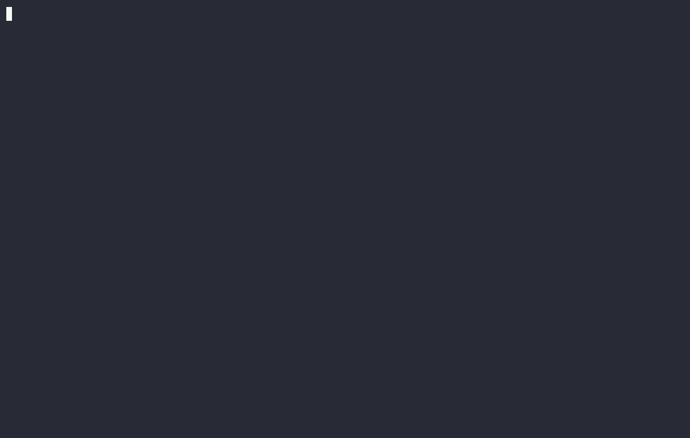

# thurbox-code-review

Code review for thurbox's v2 plugin interface, as a third tab of the agent pane:
**Agent / Shell / Review**. Review shows the diff of a session's worktree against
its base branch, and it behaves exactly as Shell does: the same chip on the same
strip, a chord that toggles it, a tab remembered per session, and no stop of its
own on `Ctrl+H` / `Ctrl+L`.



```text
╭ ◀ F9 ─ Agent ─ Shell · F8 ─ Review · F7 ──────────────────── main..HEAD  +8 -4 ╮
│docs/                 │ ▾D docs/old.md  +0 -1                                   │
│   D old.md +0 -1     │@@ -1 +0,0 @@                                            │
│   R renamed.md +1 -0 │ 1   - to be deleted                                     │
│src/                  │ ▾R docs/notes.md → docs/renamed.md  +1 -0               │
│   A added.txt +1 -0  │@@ -1,2 +1,3 @@                                          │
│ ✓ M one.lua +4 -2    │ 1  1  # Notes                                           │
│src/deep/nested/      │ 2  2  first                                             │
│   M two.rs +2 -1     │    3+ second                                            │
╰ j/k move ⇥ file [ ] hunk / find c note ↵ fold w wrap v split m seen t target ──╯
```

v1 shipped this natively — 1,844 lines of rendering and 2,610 of state — and it
was deleted with `src/ui`. This is the plugin that pays it back, and it is the
first consumer of `thurbox.diffs` anywhere.

## What it installs

A plugin cannot add a tab to a pane it does not own, so this repository ships
**its own agent pane**: thurbox's `ui/plugins/20_agent.lua`, vendored unchanged
from **thurbox v2.25.0**, plus the Review tab. The review itself lives in
`lib/`. Agent and Shell draw and take keys exactly as in thurbox's pane — the
tests render both side by side to prove it.

That has three consequences, and the install steps below deal with each:

- **It replaces the bundled agent pane.** Both are named `agent` and both occupy
  the `center` slot, and `plugin install` does not remove the bundled one.
- **It cannot be combined with another agent pane fork**, such as the one
  thurbox-files ships. Two forks is the same problem as two agent panes.
- **The `run` grant is made to the agent pane's file**, since the review is part
  of that pane now.

What changes on the border:

```text
before ╭ ◀ F9 ─ Agent ─ Shell · F8 ──────────────── weather (claude) [feat/x] [Idle] ╮
after  ╭ ◀ F9 ─ Agent ─ Shell · F8 ─ Review · F7 ── weather (claude) [feat/x] [Idle] ╮
```

## Install

1. **Check the thurbox version.** It needs **v2.24.0 or later**; CI tests
   v2.25.0.

   ```bash
   thurbox-cli version
   ```

   ```text
   thurbox 2.25.0
   ```

2. **Install the plugin.** This clones the repository into your interface
   directory, as `thurbox-code-review/`, and records it in `plugins.toml`.
   Nothing is run.

   ```bash
   thurbox-cli plugin install git+https://github.com/Thurbeen/thurbox-code-review
   ```

   ```text
   installed thurbox-code-review/plugins/20_agent.lua from git+https://github.com/Thurbeen/thurbox-code-review (…)
     a working copy of that repository is now in your interface directory
     `thurbox-cli plugin check` to confirm it loads and draws
   ```

3. **Remove the bundled agent pane.** This plugin's agent pane replaces it.

   ```bash
   rm "$(thurbox-cli plugin dir --text | head -1)/plugins/20_agent.lua"
   ```

   Deleting a file thurbox ships is how you remove it: it is recorded as removed
   and no upgrade writes it back. Or turn it off instead: in thurbox, `Ctrl+,`
   (or `F6`) → `]` for the Interface tab → `j`/`k` to `plugins/20_agent.lua` →
   `space`. Either way the stock pane is one key away — see step 8.

4. **Check that exactly one agent pane loads.**

   ```bash
   thurbox-cli plugin check
   ```

   ```text
   ~/.config/thurbox/ui
     ✓ loads — sessions, agent, confirm, rename, search, new_session, restore
   ```

   `agent, agent` and a warning about `plugins/20_agent.lua` mean step 3 was
   skipped — see [Troubleshooting](#troubleshooting).

5. **Turn it on, if settings show it off.** In thurbox, `Ctrl+,` (or `F6`) →
   `]` → `j`/`k` to `thurbox-code-review/plugins/20_agent.lua` → `space`. A
   file you turned off stays off by its path, so if you ever turned this one off,
   a reinstall brings it back **off** — `plugin check` then lists no `agent` at
   all.

6. **Optionally, grant `run`.** Same row, while it is on → `t`. The review works
   without it: the kernel computes the branch diff (or the working changes, for
   a session with no base branch). `run` unlocks the other targets of the `t`
   picker — the uncommitted changes of a session that has a base branch, and
   single commits — by running `git` on a worker. Nothing is run until you open
   the picker. The grant is recorded against the installed version: after a
   `plugin update` that moves it, `t` asks again.

7. **Open the Review tab.**

   - `F7`, from any pane — press it again to go back to the agent;
   - a click on the `Review · F7` chip;
   - `Ctrl+P` → `review` → *review this session's changes*;
   - `Ctrl+X`, but only from a pane with no terminal, such as the session list:
     a focused terminal keeps `Ctrl+X` for the program in it.

   `Esc` on the Review tab shows the agent again, and so does `e` after sending
   the notes.

8. **Update, remove, and get the stock agent pane back.**

   ```bash
   thurbox-cli plugin update                                          # every entry
   thurbox-cli plugin remove thurbox-code-review/plugins/20_agent.lua  # by the file it delivered
   ```

   The entry has no name of its own, so `plugin remove` takes the file.
   Removing it leaves **no** agent pane until you restore thurbox's: `Ctrl+,`
   (or `F6`) → `]` → `plugins/20_agent.lua` → `r` (or `space`, if you turned it
   off in step 3). `plugin check` then lists `agent` again.

## Troubleshooting

**There is no Review tab.** Run `thurbox-cli plugin check`.

- `agent, agent` — the bundled pane still loads. Do step 3.
- no `agent` at all — this pane is off. Do step 5. A load error shows on its row
  in the Interface tab, and in `thurbox-cli plugin list`.
- an older thurbox — `thurbox-cli version` below 2.24.0. Upgrade thurbox.

**Two agent panes are enabled.** This happens with the bundled pane, or with
another fork such as thurbox-files' `20_agent.lua`. Both load; the first in load
order is drawn, and `plugin check` warns that the other `shares the "center"
slot and is not the one shown by default`. In a test with each pair, this pane
was the one drawn, and it misbehaves in the same way: `Ctrl+L` stops on the
hidden one and brings it forward, so the strip loses its Review chip and the
ring has three stops for two visible panes. Keep one — turn the other off with
`space` in the Interface tab. Two forks of the agent pane cannot be combined;
their changes would have to be merged into one file.

**`F7` does something else, or nothing.** Another plugin declares `f7` too. `F1`
opens Keybindings, which lists what every key is bound to: move to *review this
session's changes* (or to the other binding) and press `r` to rebind it. The
Review chip and `Ctrl+P` reach the tab whatever `F7` does.

**Letters, `Tab` and `Esc` go to the agent.** On the Agent and Shell tabs they
should. The review's keys are declared on the agent pane, and each one is handed
on to the terminal unless the Review tab is showing.

## Keys

On the Review tab:

| | |
|---|---|
| `F7` / `Ctrl+X` | show the Review tab, or the Agent tab if Review is showing (global; `Ctrl+X` only from a pane with no terminal) |
| `j` `k` `↑` `↓` | move by one logical row |
| `PgUp` `PgDn` `g` `G` | page, top, bottom |
| wheel | move by one logical row |
| `⇥` `⇧⇥` | next / previous file, walking the **list** — which reaches files whose patch the cap cut |
| `[` `]` | previous / next hunk |
| `h` `l` `←` `→` | scroll the body horizontally (the gutter stays pinned) |
| `v` | side by side, or unified |
| `w` | soft-wrap long lines (unified only) |
| `f` | show or hide the changed-files list |
| `/` then `↵` | find in the diff, then keep it and stop typing |
| `n` `N` | next / previous match |
| `m` | mark the current file seen — which folds it (**transient**, see below) |
| `t` | review a commit, the branch, or the working changes (see below) |
| `↵` | fold or unfold this file (or keep the search, while typing one) |
| `r` | recompute the diff |
| `c` | note on the line or file under the cursor |
| `s` | note on the review as a whole |
| `x` `Del` | delete the note under the cursor |
| `e` | send the notes to the session's agent, and show the Agent tab |
| `Esc` | close the find bar, the picker or the note — or show the Agent tab |

On the Agent and Shell tabs every one of these letters reaches the terminal, as
it always did. `F1` lists them under the agent pane, because that is the pane
that declares them.

`r` is refresh rather than v1's mark-reviewed, because `r` is refresh in every
other pane and a chord that means two different things depending on where you
are standing is worse than one spelled differently here. Marking is `m`.

`v`, `w`, `f` and the syntax switch are the **same** four settings you see in
`Ctrl+,` → Plugins, under the agent pane as `review_side`, `review_wrap`,
`review_files` and `review_syntax` — the key writes the setting rather than
shadowing it, so the modal always shows what the keys did and resetting it there
works.

## Choosing what to review

`t` opens v1's picker: **the branch** (`base..HEAD`), the **working changes**
(uncommitted), or **one commit**. It opens on the row you are already looking at,
so `t ↵` changes nothing.

The kernel computes exactly one of those — the branch when a session has a base,
the working changes when it does not. The rest are asked for by running `git`,
which is why the agent pane declares one capability on the review's behalf:

```lua
capabilities = { "run" },
```

**Untrusted, everything else still works.** `run` is simply absent until you
grant it (install step 6), and without it the review draws the kernel's diff —
`t` still opens, and names the choices it cannot serve rather than hiding them.
**Nothing is run until you open the picker**, and nothing at all for the target
the kernel already has.

**Uncommitted means uncommitted, including files git has never seen.** `git diff
HEAD` does not show an untracked file, and writing new files is most of what an
agent does — so a working diff without them is the wrong answer to the question
the target is asking. Each one is diffed against nothing (`--no-index`), which
costs a process apiece, so the walk stops at 200 and says how many it did not
reach. Ignored files stay out, and the repository is never written to: the
one-process alternative (a scratch `GIT_INDEX_FILE` plus `git add -A`) puts loose
objects in the repo you are reviewing, every few seconds, while an agent edits in
it.

The kernel's own working diff — what a session with **no base branch** shows by
default — includes untracked files the same way, with a cap of its own. Past
either cap, the banner says how many untracked files are not listed.

Two sources for one diff is a real cost and the review does not pretend
otherwise:

- **The cap differs.** The kernel cuts a body at 4 MiB; a run's output is cut at
  256 KiB. The banner names whichever one applied, so "the first 256 KB git
  printed" and "4.0 of 21.1 MB" are two different sentences on purpose.
- **The file list is never cut with the body.** One `--numstat --raw -M -z`
  gives the complete list whatever the patch cost — the same split the kernel
  made in `962aef7`, for the same reason.
- **A cut capture is trimmed to a line.** The kernel cuts on a line boundary and
  a capture does not, so the half line goes rather than being parsed as an
  addition of a line that does not exist.

`KERNEL-GAPS.md` §4 has the shape a kernel-side `DiffStore` keyed on
`(session, target)` would take, and what it would fix that this cannot.

## The fork, and keeping it current

`plugins/20_agent.lua` is thurbox's agent pane with a Review tab added, and its
history is built so an upstream change to the pane is a merge:

- one commit, `chore(agent): vendor thurbox v2.25.0's ui/plugins/20_agent.lua
  unchanged`, is the file exactly as shipped (it has not changed upstream since
  v2.19.0);
- the next commit is the whole fork. Every line it adds or alters carries
  `review tab:`, and the table the pane returns is upstream's line for line — the
  review's keys, settings and capability are appended after it.

When a thurbox release changes `ui/plugins/20_agent.lua`:

```bash
# On a branch from the last vendor commit, take the new file as it is…
git switch -c vendor-vX.Y.Z "$(git log --format=%H -1 --grep='^chore(agent): vendor')"
git -C /path/to/thurbox show vX.Y.Z:ui/plugins/20_agent.lua > plugins/20_agent.lua
git commit -am "chore(agent): vendor thurbox vX.Y.Z's ui/plugins/20_agent.lua unchanged"
# …then merge it, and let the tests say whether Agent and Shell still match.
git switch main && git merge vendor-vX.Y.Z
```

`tests/agent.lua` loads the pinned tag's pane beside this one and fails if the
Agent or Shell tab draws or routes a key differently, so bump `THURBOX_TAG` in
`.github/workflows/ci.yml` in the same change.

**It costs the Agent tab its `pure` flag.** The review parses a large diff a
bite per render, and a pure pane is not rendered again until something it read
changes — so this pane renders every frame, where thurbox's is skipped when
nothing moved. `MEASUREMENTS.md` has the number: about a tenth of one of the
kernel's instruction batches a frame.

## The one rule

**One logical diff row is one selectable unit.** Wrapping expands *visual* rows
only; the cursor, the scroll anchor, the scrollbar thumb and every hitbox stay
indices into one flat logical list. That is v1's rule and it is what makes a
comment anchor mean anything later. `lib/rows.lua` is the only file that knows a
row can occupy more than one line — deliberately, because the moment those two
ideas share a variable the rule is gone.

## How it is built

The agent pane draws the frame on every tab — the tab strip on the top border,
the title on the right of it — and on the Review tab it hands the render, keys
and clicks to `lib/review.lua`. The review puts its key hints on the bottom
border and its scrollbar on the right border column, both overlays of the same
kernel frame, so they cost no content row or column. A review that throws is
drawn as an error inside that frame, under the strip, so a bug in the diff code
never takes the terminal tabs with it.

Two shapes inside the frame, which is design.md **D2**:

- the **changed-files list is a tree** — `text` rows carrying `id` and
  `role = "row"`, so they are selectable, clickable and decoratable by a pane
  that has never heard of this one;
- the **diff body is a surface** — cells positioned by character measurement
  against the width the kernel resolved, so wrapping, horizontal scrolling and
  colouring are decisions this plugin makes from `ctx.width`.

**D3 held: the body needed no new node kind**, and side-by-side is the proof
rather than the exception. Two columns with one selectable row spanning both are
two run-groups and a divider inside one line of cells — the plugin owns the
geometry, so the arithmetic is its own. Everything here is `text`, `box` and
`surface`. There are still four, and `tests/run.sh --render` asserts it
mechanically.

The body is **clickable** through the same primitive: a `surface` takes an `id`
like any node, the kernel records its rect, and a click arrives with `x`/`y`
inside it. The review resolves that to a logical row from the map it drew — which
it can, because it decided where every row went. Per-line identity in the node
tree was never the only way to be clickable.

Colour is roles only — `diff_added`, `diff_removed`, `diff_added_bg`,
`diff_removed_bg`, `branch_name`, `selection_*` — so the review is themed by all
36 presets, and by any theme you wrote, without this file knowing they exist.

**The code is coloured too**, by a small language-agnostic lexer in
`lib/syntax.lua` — comments, strings, numbers, keywords and capitalised names.
With it on, the add/remove signal moves entirely to the **sign column and the
row's background tint** and the foreground belongs to the code, because a line
cannot carry two meanings in one colour. It costs about 0.75 of one instruction
batch per frame and does not grow with the diff, since only the visible lines are
ever lexed. Turn it off in `Ctrl+,` → Plugins.

There is no syntax palette to draw on — no `syntax_keyword` — so the classes
borrow roles that already exist, mapped exactly as v1 mapped them. The cost of
that is real and worth knowing: on a theme where `branch_name` and `diff_added`
resolve to the same colour, a string inside an added line matches its `+` sign.

The parser is **incremental**: it reads a bounded number of lines per frame and
the review draws what exists so far. `MEASUREMENTS.md` records why, and what was
measured to pick the number.

Five states, each drawn differently, because the kernel is explicit that they
must be distinguishable:

| | |
|---|---|
| no entry in `thurbox.diffs` | `⠴ Asking for the diff…`, animated |
| `pending` | `⠦ Building diff…` + the range, animated |
| `failed` | the kernel's own reason, in the `danger` role |
| `ready`, no files | a **static** `No changes` + the range that was diffed |
| `truncated` | a banner counting what is missing — "77 of 400 changed files are shown (4.0 of 21.1 MB)" |

The first two move and the fourth does not, which is what the eye actually
reads. A slow diff must never look like a clean worktree.

## What is missing, and why it is missing rather than faked

**Comments and review marks do not persist.** The kernel still has the storage
v1 used — `storage::review`, `review_comments` and `review_marks`, schema v38,
keyed on the write-once `sessions.base_branch` — but none of it is published to
Lua and there is no command to write one. `m` keeps its marks in `state`, which
survives a reload and **not** a restart; the footer calls them "seen" rather than
"reviewed" for that reason.

`KERNEL-GAPS.md` states the exact read and command that would close comments, and
the smaller gaps ranked by what using the review actually made me want.

## Notes

Press `c` on a line and type. `⇥` cycles the classification (issue / suggestion /
note / praise), `↵` saves, `esc` discards. `s` writes a note about the review
rather than a line. Notes appear as rows in the diff under what they are about —
one row each, selectable like any other — so `↵` on one edits it and `x` deletes
it. `e` sends them all to the session's agent — and once there is a note, the
footer offers `e send` beside `c note` rather than last, where a narrow pane
trimmed it — in the markdown v1 sent:

```markdown
# Code review

## src/one.lua
- **[Issue]** (new:12) this needs a test
- **[Note]** (file) worth splitting up

## Summary
- **[Praise]** clean change overall
```

**Notes are lost when thurbox quits.** They survive an `F10` reload and not a
restart, because `state` — the plugin store — is an in-memory map the kernel
never writes to disk, whatever the docs used to say. The review tells you so on
the line where you are typing, not only here.

That is the sitting they are for: read a diff, note what you find, send it. The
**sending** is not provisional — `command("send", …)` has always worked. Durable
notes need the kernel to persist plugin state, or to publish the
`review_comments` table it already carries; `KERNEL-GAPS.md` §1 has both shapes,
and the general one is the better ask. If it lands, these notes stop evaporating
without the review changing.

## Marking and folding are two things

A file is collapsed when `reviewed XOR override` — v1's rule, kept exactly.
Marking a file seen folds it, because the point of marking it is that you are
done; `↵` then flips the override, so you can **peek into a file you have marked
without unmarking it**, or fold one you have not. Both states are on the header
at once: `✓` is seen, the chevron is folded.

```text
 ▾M src/one.lua  +4 -2      seen? no    folded? no
✓▸M src/one.lua  +4 -2      seen        folded (marking did it)
✓▾M src/one.lua  +4 -2      seen        peeked into, still seen
```

Folding filters whichever list is in force, so it composes with side-by-side
rather than being a third view of the diff.

## Absent because there is nothing, or because it has not happened yet

One rule, in three places, and worth stating because the second and third read as
inconsistency otherwise:

| | |
|---|---|
| the kernel | `ready` with no files is "nothing changed"; `pending` is "not yet". One is a static line, the other animates |
| the file list | a file whose **patch was cut** is muted and not a click target — there is nothing behind it. A file the **parse has not reached** stays clickable, and the click is honoured the moment it arrives |
| a binary file | listed with **zero** counts rather than dropped: it changed, and `--numstat` simply has nothing to count |

The middle row is the one that bites. The kernel lists every changed file and caps
only the patch, so on a large diff the list is complete while the body is not —
the banner says which ("the patch is capped: 77 of 400 changed files are shown").
Those extra files are real and reachable: **the list has a cursor of its own**,
and `⇥` walks it. Where the body can follow it does, and the two stay in step;
where it cannot, only the list moves and lands on a muted row. Any movement of
the body puts the list back to following it, so the two can never silently
disagree. `m` marks whatever the list is on, so a file you had to read elsewhere
can still be ticked off.

## Developing

```bash
# The Lua tests need thurbox's `ui/` at the tag CI pins. A checkout works, or
# just the tree: git -C <thurbox> archive v2.25.0 ui thurbox.yml | tar -x -C <dir>
export THURBOX_REPO=/path/to/thurbox

selene .                      # the sandbox contract, statically
stylua --check .
thurbox-cli plugin check      # loads the interface the way thurbox does
tests/run.sh                  # the pure modules, under a real Lua
tests/run.sh --render         # the review's node tree, and the agent pane's tabs
tests/run.sh --measure        # the cost, in the kernel's own unit
tests/render-proof.sh         # the tabs and the review, in a real thurbox
```

`.publish.yaml` declares the same checks as the gate, and CI
(`.github/workflows/ci.yml`) runs them against the pinned thurbox tag, plus
`plugin check` on a real install made with that release's `thurbox-cli` — with
the bundled agent pane deleted as step 3 says, asserting one `agent` and no
warning. The vendored `thurbox.yml` must match the tag's; CI says so when it
drifts.

`tests/render-proof.sh` runs against a release as well as a checkout: extract
`ui/` and `scripts/dev/lib/` from the tag into `THURBOX_REPO` and point
`THURBOX_BIN` at that release's binaries.

The GIF above is `demo/record.sh`: a throwaway thurbox (`demo/sandbox.sh` — its
own `HOME`, XDG roots and tmux socket, and a made-up project) recorded with
asciinema, driven by tmux because F7 is an F-key, and rendered with agg. It
refuses to render a cast that contains the recording machine's username,
hostname or paths.

Three layers, because each catches what the one below cannot:

- **`plugin check`** loads the interface but never calls `render`, so it cannot
  tell a pane that draws from a pane that throws.
- **`tests/run.sh --render`** calls `render` against a faked snapshot and asserts
  on the node tree — including, mechanically, that every node kind is one of the
  four, and that the Agent and Shell tabs are thurbox's own. A screenshot shows
  *what* was painted; this shows *why*.
- **`tests/render-proof.sh`** stands up a hermetic thurbox in a tmux pane with
  real sessions, worktrees and base branches, drives it with keys and mouse
  reports, and captures the frames. It is where the things only a real kernel
  decides are asserted: that the review's letters reach the agent on the Agent
  tab, that `Ctrl+H` / `Ctrl+L` have two stops, and that a click on a chip selects
  its tab.

Between them they found every bug this review has had: the scrollbar's missing
`▼`, a footer that advertised a bare `e` with no label, a files list that printed
`src/` twice, a search box that refreshed the diff when you typed the `r` in
"greet", and file rows that went dead while a large diff was still parsing.

The middle layer exists because a capture once *misled* me — a torn frame, top
border from one paint and bottom from the one before, that looked like the pane
choosing the wrong footer. Captures are evidence about pixels, not about
decisions.

Both scripts write only under `$XDG_CACHE_HOME` and a temp directory; nothing
generated lands in this working copy, because a dirty tree is what makes
`plugin update` refuse to move. That is also why there is no `.gitignore`: there
is nothing this repository generates for one to cover.

## Licence

MIT. See `LICENSE`.
